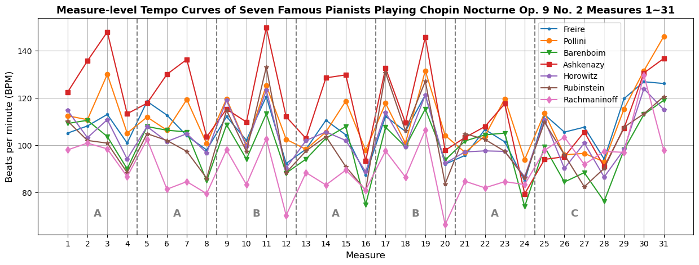

Seven Famous Pianists Playing Chopin Nocturne Op. 9 No. 2
================

This dataset contains an MEI score of Chopin Nocturne Op. 9 No. 2, links to recordings of seven famous pianists playing this piece, and audio-to-score alignment data of these recordings.

There are three alignment files for each recording, aligning at the note, beat, and measure levels respectively. The last three measures (cadenza) are ommitted in all alignment files. Each file contains a column of score times and a column of timestamps in seconds. A score time has the format of [Measure]+[Fration], where the fraction represents the position within the measure. For example, the label “1+0/1” stands for the beginning of the first measure, and the label “1+3/4” stands for *after* three quarter notes worth of time in the first measure.

Together with the MEI score and the recordings, the alignment files can be loaded in the application [*Piano Precision*](https://github.com/yucongj/piano-precision).
